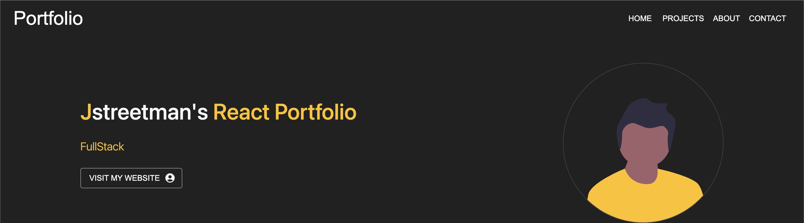

# ReactJS Portfolio With Admin Panel

A very neat react portfolio app that uses MongoDb, Express, ReactJs, and NodeJS

REST API was implemented on the backend. Material Ui React was used on the frontend.





## Intructions

Fork, then download or clone the repo.

```bash
git clone https://github.com/<your-user-name>/react_portfolio.git
```

The _config_ folder contains a file named _db.js_. Before running locally, change the value of `db` as seen in the code below. _Make sure MongoDB service is running._

```js
module.exports = {
  db: "mongodb://localhost/yourdbcollection",
};
```

## Back-end

Install the dependencies via the terminal.

```bash
npm install
```

Run the _main server_.

```bash
CORS=1 node server
```

View [http://localhost:3000](http://localhost:3000) on the browser.

## Front-end

If you want to modify the front-end, go to _client_ folder via the terminal.

```bash
cd client
```

Install the dependencies required by React.

```bash
npm install
```

Run the _development server_ for React.

```bash
REACT_APP_API_URL=http://localhost:3000 npm start
```

View [http://localhost:3001](http://localhost:3001) on the browser.

To make a production build, simply run on _client_ folder via the terminal.

```bash
npm run build
```

It re-creates a folder named _public_ on the root directory. This is where the production-ready front-end of the web application resides.
